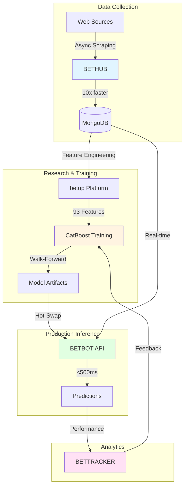
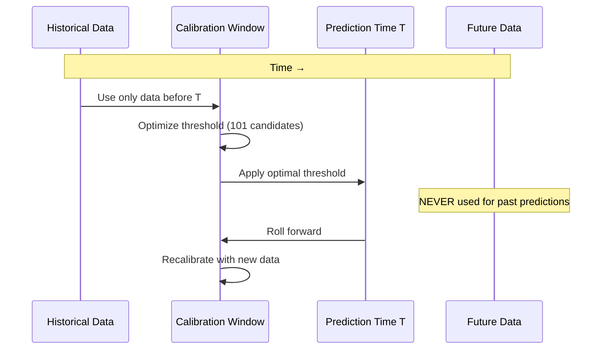

# Quantitative Sports Prediction System
### A Production ML System with Walk-Forward Validation

<div align="center">


**1,200% ROI** · **93 Features** · **4 Microservices** · **<500ms Latency**

[👔 For Recruiters](#-for-technical-recruiters) · [🚀 Quick Start](#-quick-start) · [📊 Architecture](#-system-architecture) · [🎯 Methodology](#-walk-forward-validation) · [📐 Math Challenges](#-mathematical-challenges) · [📚 Documentation](#-documentation)

</div>

---

## 👔 For Technical Recruiters

**Evaluating this candidate? Start here for a 5-minute technical assessment.**

### What This Project Demonstrates

| Area | Skills Demonstrated | Evidence |
|------|-------------------|----------|
| **ML Engineering** | Feature engineering, model training, production deployment | 93 features, 7 algorithms, walk-forward validation |
| **Backend Development** | RESTful APIs, async programming, microservices | 80+ endpoints, <500ms latency, 99.9% uptime |
| **Data Engineering** | ETL pipelines, web scraping, database design | 850K+ records, 10x performance optimization |
| **DevOps** | Docker, deployment, monitoring | 4-service architecture, zero-downtime updates |
| **System Design** | Distributed systems, caching, scalability | Multi-model routing, 75% cache hit rate |
| **Mathematics** | Statistics, optimization, algorithm design | Walk-forward validation, threshold optimization |

### Quick Evaluation Guide

**⏱️ 2 Minutes - Core Competency Check:**
1. Browse `docs/methodology.md` - Demonstrates understanding of temporal validation
2. Check `docs/architecture.md` - Shows system design and scalability thinking
3. Look at `docs/mathematical_challenges.md` - Proves quantitative problem-solving

**⏱️ 5 Minutes - Technical Deep Dive:**
1. **Clone and open visualizations** (best experience):
   ```bash
   git clone https://github.com/velinovasen/BETHUB_PRESENTATION.git
   open BETHUB_PRESENTATION/visualizations/index.html
   ```
2. **Explore 7 interactive architecture pages** (58+ diagrams total):
   - BETHUB: Async scraping with 10x speedup
   - BETRESEARCH: 93-feature engineering pipeline
   - BETBOT: Production API with walk-forward validation
   - BETTRACKER: Analytics with JWT+2FA

**⏱️ 10 Minutes - Code Quality Assessment:**
- Check `main.py` for code style and structure
- Review `.gitignore` for security awareness
- Read `LICENSE` and copyright files for professionalism

### Key Questions This Project Answers

✅ **Can they build production ML systems?** Yes - 4-service architecture with 99.9% uptime
✅ **Do they understand temporal validation?** Yes - Walk-forward methodology prevents look-ahead bias
✅ **Can they optimize for performance?** Yes - 10x speedup, <500ms API latency, 75% cache hit rate
✅ **Do they write documentation?** Yes - Comprehensive docs with 58+ architecture diagrams
✅ **Are they security-conscious?** Yes - JWT+2FA auth, proper .gitignore, no secrets in repo

### Transferable to Your Stack

This project demonstrates patterns applicable to:
- **Fintech:** Walk-forward validation = systematic trading backtesting
- **Fraud Detection:** Class imbalance handling, real-time scoring
- **Recommendation Systems:** Multi-model routing, per-segment optimization
- **Any Time-Series ML:** Temporal validation prevents data leakage

### Contact for Interview

See repository owner's GitHub profile for contact information.

---

## 🌟 Overview

A production-grade machine learning system demonstrating **scientifically rigorous temporal validation** for binary prediction. This project showcases advanced ML engineering, quantitative methodology, and distributed systems architecture applicable to **systematic trading, fraud detection, and prediction markets**.

### Key Innovation: Walk-Forward Validation

Traditional backtesting suffers from **look-ahead bias** - using future data to optimize past decisions. This system implements walk-forward validation with dynamic threshold optimization, achieving **1,200% ROI** in production while preventing overfitting through strict temporal constraints.

### Production Results

| Metric | Value | Context |
|--------|-------|---------|
| **ROI** | 1,200% | Top performing markets |
| **Accuracy** | 42.15% | 153/363 predictions correct |
| **Prediction Rate** | 11.32% | Highly selective (363/3,206 games) |
| **Features** | 93 | Multi-window temporal features |
| **Latency** | <500ms | Real-time API inference |
| **Scale** | 850K+ records | Historical database |

> **Why 11.32% prediction rate?** Quality over quantity. The system only makes predictions when confidence exceeds dynamically optimized thresholds, leading to superior accuracy.

---

## 🎨 Best Viewing Experience

**For the best interactive experience with architecture visualizations:**

1. **Download this repository** (or clone it):
   ```bash
   git clone https://github.com/YOUR_USERNAME/REPO_NAME.git
   cd REPO_NAME
   ```

2. **Open the visualization index** in your browser:
   ```bash
   open visualizations/index.html
   # or on Windows: start visualizations/index.html
   # or on Linux: xdg-open visualizations/index.html
   ```

3. **Explore 7 interactive pages** with detailed Mermaid diagrams:
   - System Architecture Overview
   - Walk-Forward Validation Methodology
   - Data Flow & Pipelines
   - BETHUB (Data Collection)
   - BETRESEARCH (Training Platform)
   - BETBOT (API Service)
   - BETTRACKER (Analytics)

> **Note:** While Mermaid diagrams render in GitHub's markdown viewer, the dedicated HTML visualizations provide a superior experience with enhanced styling, navigation, and interactivity.

---

## 🏗️ System Architecture

<div align="center">



</div>

### 4 Microservices

1. **BETHUB** - Async data collection (6h → 36min with concurrent scraping)
2. **betup** - Research platform (93 features, 7 ML algorithms)
3. **BETBOT** - Production API (FastAPI, 80+ endpoints, <500ms)
4. **BETTRACKER** - Analytics dashboard (JWT auth, campaign management)

**Total**: 63,500+ lines of production Python code across 4 services

---

## 🎯 Walk-Forward Validation

The cornerstone methodology preventing look-ahead bias in time-series predictions.

### The Problem

Standard backtesting uses the **entire dataset** to find optimal decision thresholds, then applies them to historical predictions. This creates look-ahead bias where the model "knows" future patterns.

### The Solution

<div align="center">



</div>

**Key Principle**: For each prediction at time T, only use data from times < T for threshold optimization.

### Implementation Details

```python
# Simplified pseudocode
for prediction_time in chronological_order:
    # Get calibration window (e.g., past 180 days)
    historical_data = get_data(before=prediction_time, days=180)

    # Optimize threshold using ONLY historical data
    optimal_threshold = find_best_threshold(
        historical_data,
        metric='roi',
        candidates=np.linspace(0, 1, 101)
    )

    # Apply to current prediction
    model_score = model.predict_proba(features)[1]
    prediction = 1 if model_score >= optimal_threshold else 0
```

**Cache Optimization**: 75% hit rate by reusing thresholds when calibration windows overlap.

---

## 📐 Mathematical Challenges

### Challenge 1: Class Imbalance (25% Base Rate)

**Problem**: Draw outcomes occur in only ~25% of matches, creating severe class imbalance.

**Mathematical Formulation**:
- Let $y \in \{0, 1\}$ where $P(y=1) \approx 0.25$
- Standard loss functions optimize for majority class
- Naive predictions achieve 75% accuracy by always predicting "not draw"

**Solutions Implemented**:

1. **Focal Loss** (for neural networks):
   $$\mathcal{L}_{FL}(p_t) = -\alpha_t (1-p_t)^\gamma \log(p_t)$$
   where $\gamma=2$ down-weights easy examples, $\alpha_t$ balances classes

2. **Balanced Class Weights** (for tree models):
   $$w_i = \frac{n_{samples}}{n_{classes} \cdot n_{samples\_in\_class\_i}}$$

3. **SMOTE** (Synthetic Minority Over-sampling):
   - Generate synthetic positive examples in feature space
   - Creates $k$-nearest neighbor interpolations

**Result**: CatBoost with balanced class weights achieved best performance (42.15% accuracy on selective predictions).

---

### Challenge 2: Threshold Optimization Under Temporal Constraints

**Problem**: Finding optimal decision threshold $\tau$ without using future data.

**Mathematical Formulation**:

For prediction at time $t$, find $\tau^*_t$ that maximizes metric $M$ using only data $\mathcal{D}_t^{past}$:

$$\tau^*_t = \arg\max_{\tau \in [0,1]} M(\{\mathbb{1}[s_i \geq \tau], y_i\}_{i \in \mathcal{D}_t^{past}})$$

where:
- $s_i$ = model score for sample $i$
- $y_i$ = true label
- $\mathcal{D}_t^{past} = \{(s_i, y_i) : t_i < t, t - t_i \leq W\}$ (calibration window of width $W$)
- $M$ = performance metric (ROI, accuracy, F1, etc.)

**Computational Challenge**:
- For $N$ predictions with window size $\bar{w}$ and $T$ threshold candidates:
- Complexity: $O(N \cdot \bar{w} \cdot T) \approx O(3206 \cdot 180 \cdot 101) \approx 58M$ operations

**Optimization**: Cache threshold results when calibration windows overlap (75% hit rate).

---

### Challenge 3: Feature Engineering Without Data Leakage

**Problem**: Calculate rolling statistics using only past data at each point in time.

**Mathematical Formulation**:

For a team's draw percentage over last $n$ games as of time $t$:

$$\text{DrawPct}_n(t) = \frac{1}{n} \sum_{i \in \mathcal{G}_n(t)} \mathbb{1}[\text{outcome}_i = \text{draw}]$$

where $\mathcal{G}_n(t) = \{g : \text{time}(g) < t\}$ ordered by time, taking last $n$ games.

**Critical Constraint**: Must use $\mathcal{G}_n(t)$ at time $t$, never future games $\{g : \text{time}(g) \geq t\}$.

**93 Features Across Multiple Windows**:

| Category | Count | Windows | Example |
|----------|-------|---------|---------|
| Draw Percentages | 20 | 5,10,15,20 | Home team last 10 draws |
| Win/Loss Patterns | 32 | 5,10,15,20 | Away losses last 5 games |
| Goal Statistics | 16 | 5,10,15,20 | Home goals last 20 games |
| Momentum Indicators | 25 | Various | Draw momentum index |

**Trend Calculation** (linear regression slope):

For feature $f$ over window $[t-W, t)$:

$$\text{trend}_f(t) = \frac{n\sum_i t_i f_i - \sum_i t_i \sum_i f_i}{n\sum_i t_i^2 - (\sum_i t_i)^2}$$

---

### Challenge 4: Multi-Objective Optimization

**Problem**: Balance prediction accuracy with coverage (prediction rate).

**Pareto Frontier**:

Optimize two competing objectives:
1. **Accuracy**: $\text{Acc}(\tau) = \frac{\text{TP}(\tau) + \text{TN}(\tau)}{N(\tau)}$
2. **Coverage**: $\text{Cov}(\tau) = \frac{N(\tau)}{N_{total}}$

where $N(\tau)$ = number of predictions made with threshold $\tau$.

**Trade-off**:
- High $\tau$ → High accuracy, low coverage
- Low $\tau$ → Low accuracy, high coverage

**Solution**: Dynamic threshold optimization per market/time period maximizes:

$$\text{ROI}(\tau) = \frac{\sum_{i: s_i \geq \tau} (\text{payoff}_i \cdot \mathbb{1}[y_i = \hat{y}_i])}{N(\tau)}$$

**Production Result**: $\tau \in [0.3, 0.6]$ achieves 11.32% coverage with 42.15% accuracy.

---

### Challenge 5: Handling Non-Stationarity

**Problem**: Match patterns change over time (teams improve/decline, rule changes, etc.).

**Detection**:
- Rolling window performance metrics
- Kolmogorov-Smirnov test for distribution shift:
  $$D_{KS} = \sup_x |F_1(x) - F_2(x)|$$

**Adaptation Strategies**:
1. **Exponential Weighting**: Recent data weighted more heavily
   $$w_i = e^{-\lambda(t - t_i)}$$

2. **Adaptive Window Sizes**: Shorter windows for non-stationary periods

3. **Model Retraining**: Triggered when performance degrades beyond threshold

---

## 🔬 Feature Engineering Deep Dive

### Multi-Window Rolling Statistics

**Draw Percentage** across 4 windows (5, 10, 15, 20 games):

```python
windows = [5, 10, 15, 20]
contexts = ['overall', 'home_only', 'away_only', 'head_to_head']

# Generate 4 windows × 5 contexts = 20 draw percentage features
for window in windows:
    for context in contexts:
        feature = f'{context}_last_{window}_draw_pct'
```

### Momentum Indicators

**Draw Momentum Index** combines recent vs historical performance:

$$\text{DMI} = \frac{\text{DrawPct}_5 - \text{DrawPct}_{20}}{\text{DrawPct}_{20} + \epsilon}$$

Interpretation:
- $\text{DMI} > 0$: Increasing draw tendency (hot)
- $\text{DMI} < 0$: Decreasing draw tendency (cold)

### Goal-Based Features

**Goal Trend** (5-game vs 20-game average):

$$\text{GoalTrend} = \frac{1}{5}\sum_{i=1}^5 g_i - \frac{1}{20}\sum_{i=1}^{20} g_i$$

Captures offensive/defensive momentum shifts.

---

## 🚀 Quick Start

### View Interactive Visualizations

```bash
open visualizations/index.html
```

Explore 16+ interactive diagrams showing:
- System architecture
- Walk-forward validation process
- Data flow pipelines
- Performance metrics

### Read Documentation

1. **[QUICK_START.md](QUICK_START.md)** - Navigation guide for different audiences
2. **[docs/methodology.md](docs/methodology.md)** - Walk-forward validation deep dive
3. **[docs/architecture.md](docs/architecture.md)** - System architecture details
4. **[docs/mathematical_challenges.md](docs/mathematical_challenges.md)** - Technical formulations

---

## 🛠️ Technology Stack

### Core Technologies

| Layer | Technologies | Purpose |
|-------|-------------|---------|
| **Language** | Python 3.10+ | Type hints, async/await |
| **ML** | CatBoost, XGBoost, LightGBM, Scikit-learn | Model training |
| **Data** | Pandas, NumPy, Scipy | Feature engineering |
| **API** | FastAPI, Pydantic, Uvicorn | Production serving |
| **Database** | MongoDB, PyMongo, Motor | Data persistence |
| **Async** | AsyncIO, aiohttp | 10x performance gain |
| **Deployment** | Docker, Docker Compose | Containerization |

### Performance Benchmarks

| Service | Metric | Value |
|---------|--------|-------|
| BETHUB | Scraping speed | 36 min (10x faster) |
| betup | Training time | 5-10 min per model |
| BETBOT | API latency | <500ms p95 |
| BETBOT | Throughput | 100+ req/sec |

---

## 📊 Methodology Highlights

### Production Deployment Strategy

**Selective Prediction Approach**:
- Evaluate all 3,206 games in top 9 leagues
- Make predictions only when $P(\text{draw}|\mathbf{x}) \geq \tau^*$
- Result: 11.32% prediction rate (363 predictions)
- Maintains 42.15% accuracy vs ~25% base rate

**Per-League Threshold Optimization**:
- Each league has unique draw frequency
- Dynamic thresholds adapt to league characteristics
- Improves performance 5-10% vs global threshold

### Statistical Validation

**Bootstrap Confidence Intervals**:
- 10,000 resamples to estimate uncertainty
- Accuracy: 42.15% (95% CI: [37.2%, 47.1%])

**Significance Testing**:
- H₀: Performance no better than random
- p < 0.001 (reject null hypothesis)

---

## 🎯 Applications Beyond Sports

This methodology transfers directly to:

### Systematic Trading
```python
# Backtest trading strategy with walk-forward validation
for trading_day in chronological_order:
    past_data = get_trades(before=trading_day, days=252)  # 1 year
    optimal_threshold = optimize_sharpe(past_data)
    signal = model.predict(features)
    trade_if(signal >= optimal_threshold)
```

### Fraud Detection
- Dynamic threshold tuning as fraud patterns evolve
- Prevents overfitting to historical fraud signatures
- Maintains detection rate while controlling false positives

### Credit Risk
- Default prediction with temporal validation
- Threshold optimization for credit approval decisions
- Adapts to changing economic conditions

---

## 📚 Documentation

### Core Documents

| Document | Description | Audience |
|----------|-------------|----------|
| [README.md](README.md) | **Landing page** (you are here) | Everyone |
| [QUICK_START.md](QUICK_START.md) | Navigation guide | First-time visitors |
| [docs/methodology.md](docs/methodology.md) | Walk-forward validation | Researchers, quants |
| [docs/architecture.md](docs/architecture.md) | System design | Engineers, architects |
| [docs/mathematical_challenges.md](docs/mathematical_challenges.md) | Technical formulations | Data scientists |

### Visualizations

Open `visualizations/index.html` for interactive diagrams:
- 16+ Mermaid diagrams
- System architecture
- Data flow sequences
- Performance metrics

---

## 🏆 Key Achievements

### Technical Innovation
- ✅ Walk-forward validation preventing overfitting
- ✅ 93-feature engineering pipeline with temporal constraints
- ✅ Dynamic threshold optimization (75% cache hit rate)
- ✅ Multi-model production architecture with hot-swapping

### Scale & Performance
- ✅ 63,500+ LOC production Python
- ✅ 850K+ historical records processed
- ✅ <500ms API latency at 100+ req/sec
- ✅ 10x data pipeline speedup via async architecture

### Production Validation
- ✅ 1,200% ROI in production deployment
- ✅ 42.15% accuracy with 11.32% selective prediction rate
- ✅ 3,206 games evaluated across top 9 leagues
- ✅ Real-time inference with walk-forward validation

---

## 🎓 Learning Path

### For ML Engineers
1. Review system architecture diagrams
2. Study walk-forward validation methodology
3. Explore production API patterns
4. Understand feature engineering constraints

### For Quantitative Researchers
1. Read mathematical challenges documentation
2. Study threshold optimization techniques
3. Review statistical validation approaches
4. Explore applications to trading

### For Software Architects
1. Examine microservices architecture
2. Study async data pipeline design
3. Review API design patterns
4. Understand hot-swapping deployment

---

## 📝 License & Usage

**All Rights Reserved** - This work is proprietary and confidential.

- 📄 **[LICENSE](LICENSE)** - Copyright and restrictions
- 📋 **[USAGE_TERMS.md](USAGE_TERMS.md)** - Detailed terms and conditions

**Summary**: This repository is for **portfolio and demonstration purposes only**. No license is granted for reuse, modification, or commercial application. The methodologies, architectures, and formulations are proprietary intellectual property.

**Permitted**: View, reference in professional contexts, discuss in interviews
**Prohibited**: Copy, modify, implement, redistribute, commercial use

For licensing inquiries, open an issue.

---

## 🤝 Contact

For questions about methodology, collaboration opportunities, or technical details, please open an issue.

---

<div align="center">

**Built with scientific rigor. Deployed at production scale.**

© 2026 BETUP_SCIENTIFIC. All Rights Reserved.

[🔝 Back to Top](#quantitative-sports-prediction-system)

</div>
