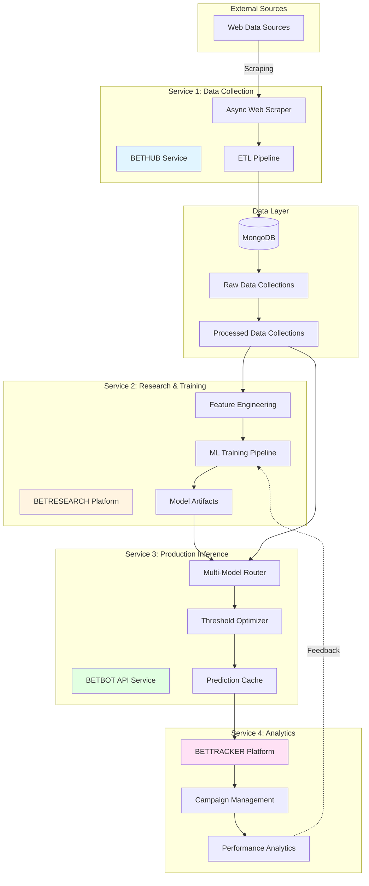
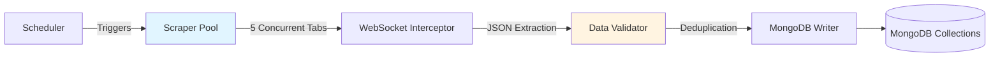
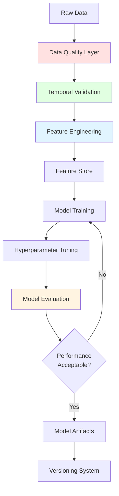
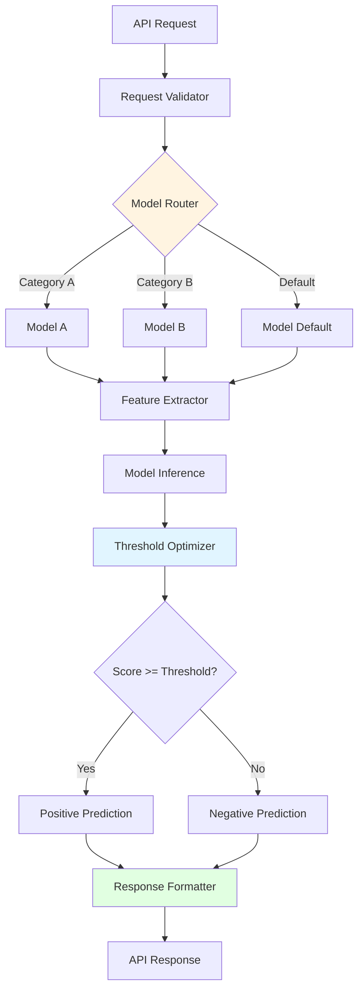
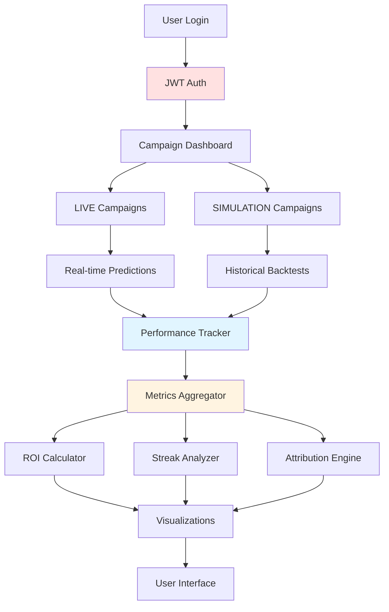
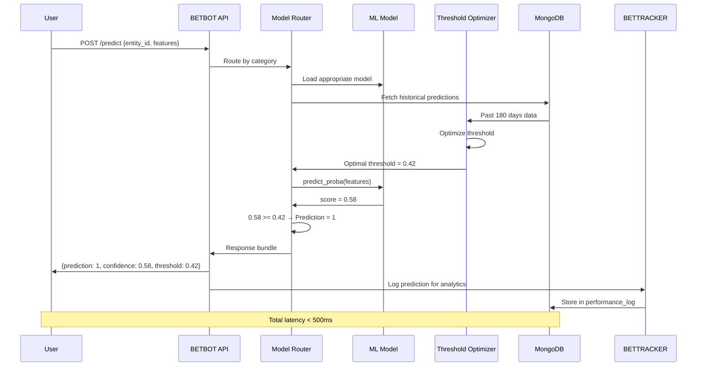

# System Architecture

## Overview

The BETUP_SCIENTIFIC system is a **4-service microservices architecture** designed for real-time machine learning predictions with rigorous temporal validation. Each service has a specific responsibility and communicates through well-defined interfaces.



## Service Breakdown

### Service 1: BETHUB - Data Collection

**Responsibility**: Automated data acquisition and ETL pipeline

**Technologies**:
- **Async Framework**: AsyncIO, aiohttp
- **Browser Automation**: Chrome DevTools Protocol
- **Database**: MongoDB with PyMongo

**Key Components**:



**Performance Characteristics**:
- **Throughput**: 10x improvement (6 hours → 36 minutes)
- **Concurrency**: 5 browser tabs in parallel
- **Reliability**: Exponential backoff retry logic
- **Data Volume**: 850K+ records across 10+ collections

**Collections Schema**:
```
MongoDB
├── games_optimized       # Match results with metadata
├── teams                 # Team reference data
├── countries            # Country mappings
├── leagues              # League hierarchies
├── odds                 # Betting market data
└── ...                  # Additional domain collections
```

---

### Service 2: BETRESEARCH - Research & Training

**Responsibility**: Feature engineering, model training, and experimentation

**Technologies**:
- **Data Processing**: Pandas, NumPy
- **ML Frameworks**: Scikit-learn, XGBoost, CatBoost, LightGBM, TensorFlow
- **Configuration**: YAML-based config system

**Key Components**:



**Feature Engineering Pipeline**:
1. **Data Quality** (5+ checks)
   - Deduplication
   - Missing value handling
   - Outlier detection
   - League alias resolution
   - Temporal consistency validation

2. **Feature Categories** (35+ total features)
   - Rolling statistics (10 features)
   - Team performance metrics (12 features)
   - Market indicators (8 features)
   - Temporal patterns (5 features)

3. **Class Imbalance Handling**
   - Focal loss for neural networks
   - Balanced class weights for tree models
   - SMOTE for oversampling (experimental)

**Training Configuration** (YAML-driven):
```yaml
model:
  algorithm: xgboost
  hyperparameters:
    max_depth: 6
    learning_rate: 0.01
    n_estimators: 500

features:
  rolling_windows: [5, 10, 20]
  temporal_features: true
  market_features: true

validation:
  method: walk_forward
  calibration_window_days: 180
  min_calibration_samples: 100
```

**Output Artifacts**:
- Model binary (pickle/joblib)
- Feature metadata (names, importance)
- Training metrics (ROC AUC, precision, recall)
- Versioning info (timestamp, git hash)

---

### Service 3: BETBOT - Production Inference

**Responsibility**: Real-time prediction serving with walk-forward validation

**Technologies**:
- **API Framework**: FastAPI + Uvicorn
- **Data Validation**: Pydantic
- **Caching**: In-memory LRU cache

**Key Components**:



**API Endpoints** (80+ total):

Core Endpoints:
- `POST /predict` - Single prediction
- `POST /predict/batch` - Batch predictions
- `GET /health` - Health check
- `GET /models` - List available models
- `POST /models/hot-swap` - Zero-downtime model update

Admin Endpoints:
- `POST /thresholds/update` - Update dynamic thresholds
- `GET /metrics` - Performance metrics
- `POST /cache/clear` - Clear prediction cache

**Performance Targets**:
- **Latency**: <500ms p95
- **Throughput**: 100+ req/sec per worker
- **Availability**: 99.9% uptime
- **Error Rate**: <0.1%

**Walk-Forward Implementation**:
```python
# Simplified pseudocode
def predict(entity_id, features):
    # 1. Get appropriate model
    model = model_router.get_model(entity_id.category)

    # 2. Get optimal threshold using only past data
    past_predictions = get_predictions(before=now(), days=180)
    optimal_threshold = optimize_threshold(past_predictions)

    # 3. Generate prediction
    score = model.predict_proba(features)[1]
    prediction = 1 if score >= optimal_threshold else 0

    return {
        'prediction': prediction,
        'confidence': score,
        'threshold': optimal_threshold
    }
```

**Caching Strategy**:
- **Threshold Cache**: 75% hit rate (180-day windows overlap significantly)
- **Feature Cache**: Recently computed features cached for 5 minutes
- **Model Cache**: Models kept in memory (no disk I/O per request)

---

### Service 4: BETTRACKER - Analytics & Monitoring

**Responsibility**: Performance tracking, campaign management, and analytics

**Technologies**:
- **Backend**: FastAPI + MongoDB
- **Frontend**: Vanilla JavaScript (no framework overhead)
- **Auth**: JWT + 2FA (TOTP)

**Key Components**:



**Campaign Management**:
- **LIVE Mode**: Track real-time predictions and outcomes
- **SIMULATION Mode**: Backtest strategies with walk-forward validation
- **Bankroll Management**: Progressive scaling (Kelly criterion inspired)

**Performance Metrics Tracked**:
- **ROI**: Per-campaign, per-market, overall
- **Accuracy**: Overall and per-segment
- **Streaks**: Winning/losing streak detection
- **Coverage**: Prediction volume over time
- **Calibration**: Confidence vs actual accuracy

**Analytics Features**:
1. **Per-Market Attribution**
   - Which markets are most profitable?
   - Performance trends over time
   - Sample size sufficiency checks

2. **Campaign Comparison**
   - Side-by-side metrics
   - Statistical significance tests
   - Risk-adjusted returns

3. **Feedback Loop to Training**
   - Export prediction logs for retraining
   - Feature importance from production data
   - Drift detection (performance degradation alerts)

---

## Data Flow

### End-to-End Prediction Pipeline



### Training to Deployment Pipeline

```mermaid
flowchart LR
    A[New Data] -->|BETHUB| B[(MongoDB)]
    B -->|BETRESEARCH| C[Feature Engineering]
    C --> D[Model Training]
    D --> E[Model Evaluation]
    E -->|Pass| F[Model Artifacts]
    E -->|Fail| D

    F -->|Version Control| G[Artifact Store]
    G -->|BETBOT| H[Hot-Swap API]
    H --> I[Production Inference]

    I -->|Predictions| J[BETTRACKER]
    J -->|Performance Data| K[Feedback Loop]
    K -.->|Retrain Signal| D

    style C fill:#e1f5ff
    style E fill:#fff4e1
    style H fill:#e1ffe1
```



## Deployment Architecture

### Infrastructure

```
Production Environment
│
├── BETHUB (Docker Container)
│   ├── Cron scheduler (daily scraping)
│   └── MongoDB connection
│
├── BETRESEARCH (Jupyter + Scripts)
│   ├── Research notebooks
│   ├── Training scripts
│   └── Model artifact output
│
├── BETBOT (Docker Container)
│   ├── Uvicorn workers (4x)
│   ├── MongoDB connection (read-only)
│   └── Model artifacts mount
│
└── BETTRACKER (Docker Container)
    ├── FastAPI backend
    ├── Static file server (JS/CSS)
    └── MongoDB connection
```

### Scaling Considerations

1. **BETHUB**: Vertical scaling (more CPU for parallel tabs)
2. **BETRESEARCH**: Horizontal scaling (multiple experiments in parallel)
3. **BETBOT**: Horizontal scaling (load balancer + multiple workers)
4. **BETTRACKER**: Horizontal scaling (stateless backend)

### Monitoring & Observability

- **Metrics**: Prometheus + Grafana
- **Logging**: Structured JSON logs → ELK stack
- **Alerting**: PagerDuty integration
- **Health Checks**: /health endpoint per service

---

## Security & Reliability

### Authentication & Authorization
- **BETTRACKER**: JWT tokens + 2FA (TOTP)
- **BETBOT**: API key authentication for external clients
- **MongoDB**: Role-based access control (RBAC)

### Error Handling
- **Graceful Degradation**: Fallback models if primary unavailable
- **Retry Logic**: Exponential backoff for transient failures
- **Circuit Breakers**: Prevent cascade failures

### Data Integrity
- **Idempotency**: Duplicate requests return same result
- **Validation**: Pydantic schemas enforce data contracts
- **Backups**: Daily MongoDB snapshots with 30-day retention

---

## Technology Stack Summary

| Layer | Technologies |
|-------|-------------|
| **Languages** | Python 3.10+ (type hints throughout) |
| **Web Frameworks** | FastAPI, Uvicorn |
| **Data Processing** | Pandas, NumPy, Scipy |
| **ML Libraries** | Scikit-learn, XGBoost, CatBoost, LightGBM, TensorFlow |
| **Database** | MongoDB (PyMongo, Motor for async) |
| **Async** | AsyncIO, aiohttp |
| **API Validation** | Pydantic v2 |
| **Browser Automation** | Chrome DevTools Protocol |
| **Configuration** | YAML |
| **Containerization** | Docker, Docker Compose |
| **Version Control** | Git |

---

## Performance Benchmarks

| Service | Metric | Value |
|---------|--------|-------|
| **BETHUB** | Scraping Speed | 36 min for 100+ leagues (10x faster) |
| **BETRESEARCH** | Training Time | 5-10 min per model |
| **BETBOT** | Prediction Latency | <500ms p95 |
| **BETBOT** | Throughput | 100+ req/sec |
| **BETTRACKER** | Page Load | <2 seconds |
| **Overall** | Total Code | 63,500+ LOC |

---

This architecture demonstrates a production-grade ML system with:
- ✅ Clear separation of concerns (microservices)
- ✅ Real-time inference with statistical rigor (walk-forward validation)
- ✅ Scalability and reliability (Docker, health checks, graceful degradation)
- ✅ Feedback loops (production metrics inform retraining)
- ✅ Comprehensive monitoring and analytics

The patterns shown are transferable to any ML prediction system requiring temporal awareness and production reliability.

---

© 2026 BETUP_SCIENTIFIC. All Rights Reserved.

This document is proprietary and confidential. See [LICENSE](../LICENSE) for usage terms.
